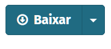
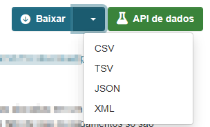

# Portal de Dados Abertos do BNDES - Exemplos

Códigos de exemplo para uso do [Portal de Dados Abertos do BNDES](https://dadosabertos.bndes.gov.br). 

## Carregando os dados

**Atenção**: desde fevereiro de 2025 mudamos o encoding padrão de nossos arquivos CSV de `UTF-8` para `windows-1252`. Desta forma os arquivos abrem no Excel sem qualquer modificação. Veja instruções abaixo sobre como baixar no encoding `UTF-8`. 

Os números estão em formato brasileiro, com a vírgula (`,`) como separador de decimais. 

Localize no Portal os recurso que deseja e clique no botão "Baixar" para fazer o download dos dados em formato CSV.



### Linguagem Python

Usando a biblioteca pandas. 

```python
df = pd.read_csv(arq_dados, sep=';', decimal=',', encoding='windows-1252') 
```

Dica: caso haja colunas de data, inclua o parâmetro: `parse_dates=['nome_col'])`

### Linguagem R

```R
dados = read.csv(arq_dados, sep=';', dec = ',', encoding = 'windows-1252')
```

### Excel

Os arquivos CSV abrirão no Excel versão brasileira sem qualquer modificação.

### Outros formatos

O botão "Baixar" traz o arquivo CSV no encoding `windows-1252` e separado por ponto e vírgula. Este encoding é praticamente idêntico ao `iso-8859-1`, também conhecido como `latin-1`. São praticamente intercambiáveis. O `windows-1252` apenas possui alguns caracteres adicionais de moedas ou pontuação que não estão presentes no `latin-1`.

Clicando na seta ao lado do botão "Baixar" aparecem outras opções de formatos, entre eles, CSV e JSON. Este CSV vem separado por vírgulas e UTF-8 com BOM (encoding `utf-8-sig`). JSON por padrão o encoding é `UTF-8`. Nestes ormatos os números estão em formato americano, então separador decimal é o ponto (`.`).



## Exemplos completos

- [python-exemplo.ipynb](python-exemplo.ipynb) - carrega dados em um Dataframe e exibe um gráfico
- [python-api.ipynb](python-api.ipynb) - usa a api para busca de dados e download
- [python-api-filtros.ipynb](python-api-filtros.ipynb) - usa a API para filtrar dados. Use para baixar só os dados que precisa e trabalhar com arquivos menores. 

### Executando o código Python 

Todas as bibliotecas utilizadas nos exemplos estão no arquivo [requirements.txt](requirements.txt). Recomenda-se o uso de um ambiente virtual:

```shell
python -m venv .venv
# ative com o ambiente virtual para sua plataforma. 
# Eg.: No Windows execute ".\.venv\Scripts\activate"
#      no Unix execute "source ./venv/bin/activate"
pip install -r requirements.txt
```

Então execute o comando `jupyter-lab` para executar os notebooks.

<!-- 
## Informações sobre as bases

Além da documentação em cada dataset, fizemos apresentações sobre os dados quando do 
[Prêmio Dados Abertos para o Desenvolvimento](https://www.bndes.gov.br/premiodadosabertos). Estas apresentações podem ser úteis para entender as bases. Estão publicadas no canal de YouTube dos organizadores do Prêmio e na descrição há um link para o momento exato no vídeo onde cada base é descrita.  

- [Apresentação 1](https://youtu.be/FC7owoLect4?t=26). Bases: Financiamento à Exportação pré e pós-embarque, Desestatização/Banco de serviços, e Operações indiretas automáticas & micro, pequena e média empresa.
- [Apresentação 2](https://youtu.be/y8caOOHlJa0?t=29). Bases: Estatísticas Operacionais, Indicadores financeiros/Contabilidade, Contratos Administrativos, Indicações a colegiados, e Renda Variável.

-->