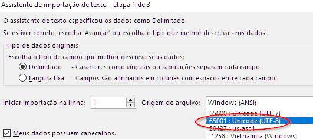
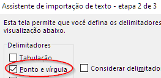

# Portal de Dados Abertos do BNDES - Exemplos

Códigos de exemplo para uso do [Portal de Dados Abertos do BNDES](https://dadosabertos.bndes.gov.br). 

## Carregando os dados

### Linguagem Python

```python
df = pd.read_csv(arq_dados, sep=';', decimal=',', encoding='UTF-8') 
```
Dica: caso haja colunas de data, inclua o parâmetro: `parse_dates=['nome_col'])`
### Linguagem R

```R
dados = read.csv(arq_dados, sep=';', dec = ',', encoding = 'UTF-8')
```
### Excel

Os arquivos abrirão direto no Excel, mas haverá problemas com palavras acentuadas. Para abrir com os acentos corretos, vá na opção _"Dados → De Texto → (selecione o arquivo)"_ e então marque `UTF-8` como "Origem do arquivo" e `Ponto e vírgula` como delimitador. Conforme as telas abaixo:





## Exemplos

- [python-exemplo.ipynb](python-exemplo.ipynb) - carrega dados em um Dataframe e exibe um gráfico
- [python-api.ipynb](python-api.ipynb) - usa a api para busca de dados e download
- [python-api-filtros.ipynb](python-api-filtros.ipynb) - usa a API para filtrar dados. Use para baixar só os dados que precisa e trabalhar com arquivos menores. 

## Executando o código Python 

Todas as bibliotecas utilizadas nos exemplos estão no arquivo [requirements.txt](requirements.txt). Recomenda-se o uso de um ambiente virtual: 
```
python -m venv .venv
# ative com o ambiente virtual para sua plataforma. 
# Eg.: No Windows execute ".\.venv\Scripts\activate"
#      no Unix execute "source ./venv/bin/activate"
pip install -r requirements.txt
```

Então execute o comando `jupyter-lab` para executar os notebooks.
